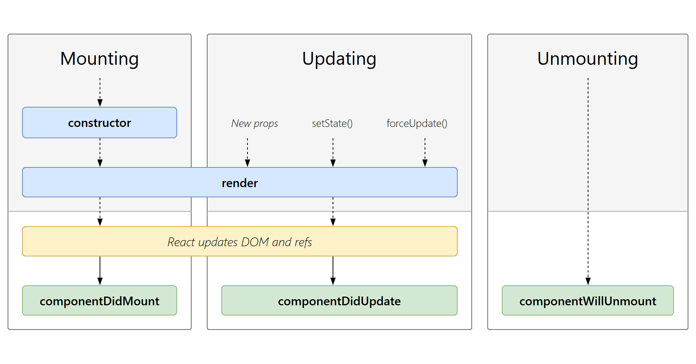

## 设计思想
#### 背景
&ensp;&ensp;&ensp;&ensp;在React Hooks出现之前，React主要采用两种方式来管理组件的状态和生命周期方法：类组件和函数组件。（类组件和函数组件写法见文末附件）

&ensp;&ensp;&ensp;&ensp;类组件继承`React.Component` 并且创建 `render` 函数返回 `react` 元素。类组件有生命周期方法（类组件的生命周期件文末附件），可以管理自己的状态，并且可以通过`this.props`来获取父组件传递的属性。

&ensp;&ensp;&ensp;&ensp;函数组件，顾名思义，是一个函数，它接收一个 `props` 对象返回一个 `react` 元素。函数组件通常用于封装一些通用的逻辑，比如组件的权限验证、组件的状态管理等。通过使用函数组件，我们可以将这些通用逻辑抽象出来并复用在多个组件之间。因为函数组件是一个纯函数，所以不能在组件中使用 setState()，这也是为什么把函数组件称作为无状态组件。函数组件也不能使用生命周期钩子，所有的生命周期钩子都来自于继承的`React.Component`中。

&ensp;&ensp;&ensp;&ensp;在使用类组件来创建组件时，会存在一些缺点。例如：需要理解`this`关键字、需要继承`React.Component`、需要使用生命周期方法等等。这些都使得编写和维护代码变得复杂。同时，函数组件和Render Props模式也不能完全解决这些问题。因此，React团队推出了React Hooks来解决这些问题，让函数组件也能够具有状态和生命周期的管理能力。
#### 函数式编程思想
&ensp;&ensp;&ensp;&ensp;React Hooks 受到了函数式编程思想的影响，特别是纯函数的概念。一个纯函数是指，给定相同的输入，总是返回相同的输出。这意味着纯函数不会产生任何副作用。React Hooks 也强调了这个概念，并将其应用到了 React 组件中。通过使用 React Hooks，我们可以创建纯函数组件，这样组件会更加可靠、可测试和易于维护。
#### Hooks的组合设计思想
&ensp;&ensp;&ensp;&ensp;React Hooks的另一个设计思想是组合。React Hooks提供了很多小型的Hook，它们可以组合在一起创建复杂的组件逻辑。这样可以使代码更加简单、易于测试和维护。例如：`useEffect`可以用于处理生命周期方法，一起使用`useContext`和`useReducer`就可以做到全局状态管理，方便在各个组件中（父子、兄弟组件）传递并操作全局数据。使用多个Hooks可以让组件更加模块化，每个Hook负责一小部分逻辑，从而使得代码更加清晰和易于理解。
#### React Hooks解决了哪些问题

- 使代码更加简洁、易于理解和维护；
- 使得函数组件具有类组件类似的功能，例如使用state和处理生命周期方法等，这使得函数组件可以作为类组件的替代方案；
- 使得代码更加可测试，因为它们使得组件更加存粹，并且减少了副作用的使用。
#### Hooks的设计原则

- 纯函数：React Hooks应该是纯函数，不应该有副作用；
- 可组合：React Hooks应该是可组合的，可以组合在一起以创建复杂的逻辑；
- 易于使用：React Hooks应该易于使用，并且应该易于理解和学习；
- 无需修改现有代码：React Hooks应该是向后兼容的，意味着我们无需修改现有代码就可以使用。
## 基本使用和原理
&ensp;&ensp;&ensp;&ensp;了解React Hooks的设计思想后，再介绍一下它的基本使用和简单原理。
#### 常用的hooks
##### useState
&ensp;&ensp;&ensp;&ensp;`[状态，设置状态函数] = useState(初始状态)`

&ensp;&ensp;&ensp;&ensp;useState是React Hooks中最基础、也是最常用的Hook之一。它可以在函数组件中使用，用来声明和管理组件内部的状态。使用useState Hook可以避免使用类组件时需要使用this.state来管理组件状态的繁琐过程，同时也能避免使用React Contex或Redux等状态管理库带来的额外复杂性。

&ensp;&ensp;&ensp;&ensp;useState的基本用法是在组件中调用该Hook，该Hook会返回一个数组，数组的第一个元素是当前状态的值，第二个元素是一个函数，用来更新该状态的值。当组件中调用该更新函数时，React会重新渲染组件，并根据新的状态值来更新组件中的内容。

&ensp;&ensp;&ensp;&ensp;示例：
```javascript
import React, { useState } from 'react';

function Counter() {
  const [count, setCount] = useState(0);

  function handleClick() {
    setCount(prevCount => prevCount + 1);
  }

  return (
    <div>
      <p>You clicked {count} times</p>
      <button onClick={handleClick}>Click me</button>
    </div>
  );
}
```
&ensp;&ensp;&ensp;&ensp;上述示例中，useState的参数是初始状态的值，这里的初始值为0。useState返回的count变量存储当前状态的值，setCount是用来更新状态的函数。在handleClick函数中，我们通过调用setCount来更新count的值，React会根据新的count值重新渲染Counter组件。
##### useEffect
&ensp;&ensp;&ensp;&ensp;useEffect是React中一个重要的Hook，相当于类组件中生命周期函数 `componentDidMount`, `componentDidUpdate` 和 `componentWillUnmount` 的结合体。用来处理组件渲染过程中产生的副作用(side effect)，副作用指一些不属于组件渲染过程中的操作，例如异步请求数据，操作浏览器缓存等。使用useEffect可以在DOM完成后执行useEffect内部的副作用。
```javascript
import { useEffect } from 'react';

function MyComponent() {
  useEffect(() => {
    // 执行副作用操作
    // ...
    // 返回清理函数（可选）
    return () => {
      // 清理副作用操作
      // ...
    };
  }, [dependencies]);
  // ...
}

```
&ensp;&ensp;&ensp;&ensp;useEffect的第一个参数是一个回调函数，这个回调函数会在组件渲染后执行。如果需要在组件卸载时执行一些清理操作，可以在回调函数中返回一个函数，在组件卸载时执行这个函数。这个清理函数可以用于取消订阅、解绑事件等操作。

&ensp;&ensp;&ensp;&ensp;useEffect还可以接收第二个参数，这个参数是一个数组，用于控制useEffect的执行时机。如果传入一个空数组`[]`，则useEffect只会在组件渲染和卸载是执行一次，相当于类组件中的 `componentDidMount` 和 `componentWillUnmount` 方法。如果传入一个数组，数组中包含了需要监听的变量，则只有这些变量发生变化时，useEffect才会执行。
##### useMemo
&ensp;&ensp;&ensp;&ensp;useMemo用于在函数组件中进行记忆化处理，也就是说通过缓存计算结果来提高性能。

&ensp;&ensp;&ensp;&ensp;`const memoizedValue = useMemo(() =>computeExpensiveValue(a, b), [a, b]);`

&ensp;&ensp;&ensp;&ensp;其中，第一个参数为一个函数，这个函数会根据参数`a`和`b`进行一些计算，返回一个值；第二个参数是一个数组，表示当其中的某些值发生变化时，需要重新计算memoizedValue的值。

&ensp;&ensp;&ensp;&ensp;useMemo的作用是将计算结果缓存起来，当第二个参数中的依赖没有发生变化时，直接返回缓存中的值，从而避免重复计算。

&ensp;&ensp;&ensp;&ensp;useMemo的基本原理是：每当组件渲染时，React会记录哪些值发生了变化。当useMemo第二个参数中的值发生变化时，React会调用第一个参数传入的函数进行计算，将结果缓存起来。当第二个参数中的值没有发生变化时，React直接从缓存中取出结果，避免了重复计算。

&ensp;&ensp;&ensp;&ensp;示例：
```javascript
import React, { useState, useMemo } from 'react';

function App() {
  const [a, setA] = useState(1);
  const [b, setB] = useState(2);

  const sum = useMemo(() => {
    console.log('calculating sum...');
    return a + b;
  }, [a, b]);

  return (
    <div>
      <p>sum: {sum}</p>
      <button onClick={() => setA(a + 1)}>Increment A</button>
      <button onClick={() => setB(b + 1)}>Increment B</button>
    </div>
  );
}
```
&ensp;&ensp;&ensp;&ensp;其中，当点击Increment A或Increment B按钮时，`sum`会重新计算，因为`a`或`b`发生了变化。如果`a`或`b`没有发生变化，则`sum`会直接从缓存中取出结果。

&ensp;&ensp;&ensp;&ensp;**注**：useMemo在某些方面类似于Vue中的计算属性computed。它们都是用来缓存一些计算结果，以避免在每次重新渲染时都重新计算。但需要注意的是，useMemo不仅仅可以缓存计算结果，还可以缓存其他数据，比如函数、组件等。而Vue的computed只能缓存计算结果。另外，Vue中的computed是一个属性，需要通过this来访问，而useMemo是一个Hook函数，直接在函数组件中使用即可。
##### 自定义Hooks
&ensp;&ensp;&ensp;&ensp;自定义Hooks可以将一些具有复杂逻辑或状态管理的逻辑抽离出来，以Hooks的形式进行封装，从而实现逻辑的复用和代码的简化。
&ensp;&ensp;&ensp;&ensp;使用自定义Hooks遵循以下原则：
```
1.创建一个函数，函数名以"use"开头，如"useCustomHook"；
2.在函数内部实现逻辑；
3.返回一个数组，数组第一个元素为状态，第二个元素为改变状态的方法；
4.在组件中使用自定义Hook，通过解构赋值获取状态和改变状态的方法。
```
&ensp;&ensp;&ensp;&ensp;它的简单原理如下：
```
1.自定义Hook实际上是一个函数，他可以使用React的内置Hooks，也可以使用其他自定义Hooks；
2.当自定义Hook在组件中被调用时，React会创建一个新的Hooks实例，并在该实例中调用自定义Hook函数；
3.自定义Hook函数内部可以使用React提供的内置Hooks来创建和管理状态。
4.自定义Hook函数可以返回任意数据类型，包括状态、函数、对象等，组件可以通过解构赋值来获取这些数据。
```
&ensp;&ensp;&ensp;&ensp;示例：
```javascript
import { useState } from 'react';
      
function useCount(initialValue) {
  const [count, setCount] = useState(initialValue);
  const increment = () => setCount(count + 1);
  const decrement = () => setCount(count - 1);
  return [count, increment, decrement];
}

function App() {
  const [count, increment, decrement] = useCount(0);
  return (
    <div>
      <p>Count: {count}</p>
      <button onClick={increment}>Increment</button>
      <button onClick={decrement}>Decrement</button>
    </div>
  );
}
```
&ensp;&ensp;&ensp;&ensp;在上述例子中，我们定义了一个自定义Hook useCount，它使用了React内置的useState Hook来创建和管理状态，并返回一个包含状态值和更新状态的方法的数组。然后在组件中使用了自定义Hook useCount，并通过解构赋值来获取状态值和更新状态的方法。这样，我们就可以在组件中很方便地使用自定义Hook实现状态的管理。
## 附
##### 类组件的生命周期方法：

- Mounting(挂载)：已插入真实DOM
- Updating(更新)：正在被重新渲染
- Unmounting(卸载)：已移出真实DOM

##### 类组件和函数组件的写法：
1、类组件
```javascript
import React from 'react'
class Welcome extends React.Component {
  constructor(props) {
    super(props)
  }
  render() {
    return <h1>welcome, {this.props.name}</h1>
	}
}

export default Welcome
```
2、函数组件
```javascript
import React from 'react'
const Welcome = (props) => {
  return <h1>welcome, {props.name}</h1>
}
export default Welcome
```
虽然以上两种写法实现的效果相同，但类组件需要更多的代码。
